<!--image from CDC's web page -->
# Characteristics of Coronavirus Hotspots
Ian Branum -- *10 April 2020*

## Table of Contents

- [Introduction](#introduction)
- [Data Sources](#data-sources)
- [Data Transformation and Feature Engineering](#data-transformation-and-feature-engineering)
- [Analysis](#analysis)
- [Conclusion](#conclusion)

## Introduction
Coronavirus is understandably on everyone's mind. Organizations from the CDC, to CNN, to the New York Times publish charts showing exponential growth rates and maps showing an uneven distribution of cases across the United States. In aggregate the message is terrifying. My intention with this study, and the ones to follow, is to zoom in on the details, to examine the spread of the virus at a more localized level. In this study I will attempt to to predict the growth of Coronavirus cases per 100,000 residents at the US county level based upon demography, geography, and governmental actions. 

## Data Sources
With this study I intend to identify the demographic characteristics that correlate to higher or lower case rates. To that end, I collected from a variety of sources as follows. 

### New York Times Coronavirus Data
The core data source for this study is the [New York Times Coronavirus](https://github.com/nytimes/covid-19-data) Github page. This page contains a listing of every case in the United States by date and county. This was the core data set to which everything else was linked. Table 1 shows the structure of the data set. As of 10 April 2020 there are **45,254** entries for **2477** distinct counties. 

> Table 1 - NYT Coronavirus Github Page
>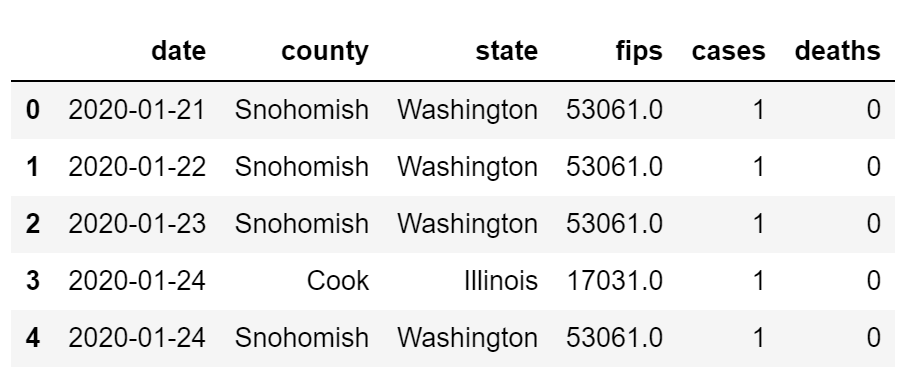

### Census Data
I pulled the bulk of the demographic data from the [Census.gov](https://data.census.gov/cedsci/) Advanced Search tool. This tool was release the first of April, replacing the previous one. Unfortunately, it seems to be buggy and has subsequently been taken down. The tool was designed to provide fused results from across their various data sets, but the fusing functionality was balky. I thus ended up pulling four separate extracts and fusing them together locally. Another shortcoming is that it is only returning reports on **840** counties. This is disappointing as it represents only one-quarter of the counties in the United States, but it is sufficiently large to still be worth exploring. Table 2 shows the subset of the columns extracted and fused actually used in exploration. 

> Table 2 - Fused Census data
>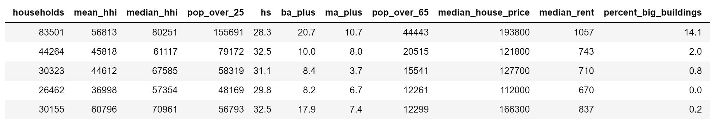

### Counties Data
For counties I needed the name, state, population, and lat/lon of the center. Fortunately, I found a [Table of United States Counties](https://en.wikipedia.org/wiki/User:Michael_J/County_table) on Wikipedia. The provenance is not great, but I spot checked it and it seems solid. It has entries for **3,143** counties in the United States. Table 3 shows the columns available. 

> Table 3 - Counties List
>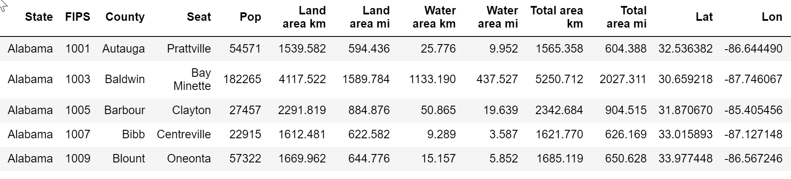

### Airports Data
Finally, as one potential hypothesis related to the effects of international arrivals on case rates, I need airport data. This was painful. I wanted both the lat/lon of the airport and the number of incoming international arrivals. I was forced to fuse two data sets, one a list of the [Top 100 US Airports](http://www.fi-aeroweb.com/Top-100-US-Airports.html) in 2017 by passenger arrivals and one from [ourairports.com](https://ourairports.com/data/airports.csv), which is an extract from the ICAO data set containing lat/lon of each airport. I would have preferred to pull directly from ICAO, but they wanted money. I fused the two together for the top **65** international airports in the United States, all those that receive more than 10,000 international arrivals per year, Table 4 shows the result. 

> Table 4 - Top Airports List
>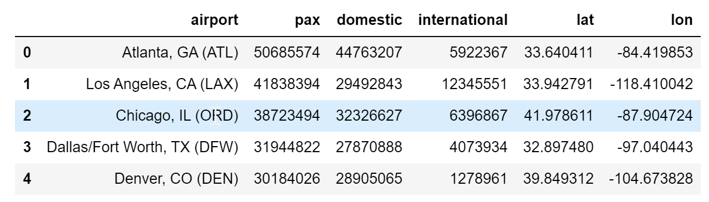

## Data Transormation and Feature Engineering
I took the various data sources, cleaned them, and then fused them into two dataframes, one with demographic and geographic data that did not change for each county the period covered and one with time-dependent data that changed each day during the period covered. In addition to some basic data cleaning, imputation, etc. it was necessary to create a number of calculated features. 

### Case Rate and Death Rate
Converted the number of cases and deaths reported by each county to the cases and deaths per 100,000 residents. 

### Days Since 10 Cases per 100k 
Counties exhibited similar patterns with regards to the outbreak -- they could dribble along for quite a while with only a few cases, but once they crossed a threshold, cases would expand exponentially. Compare the following two plots of cases by days since 1 January:

>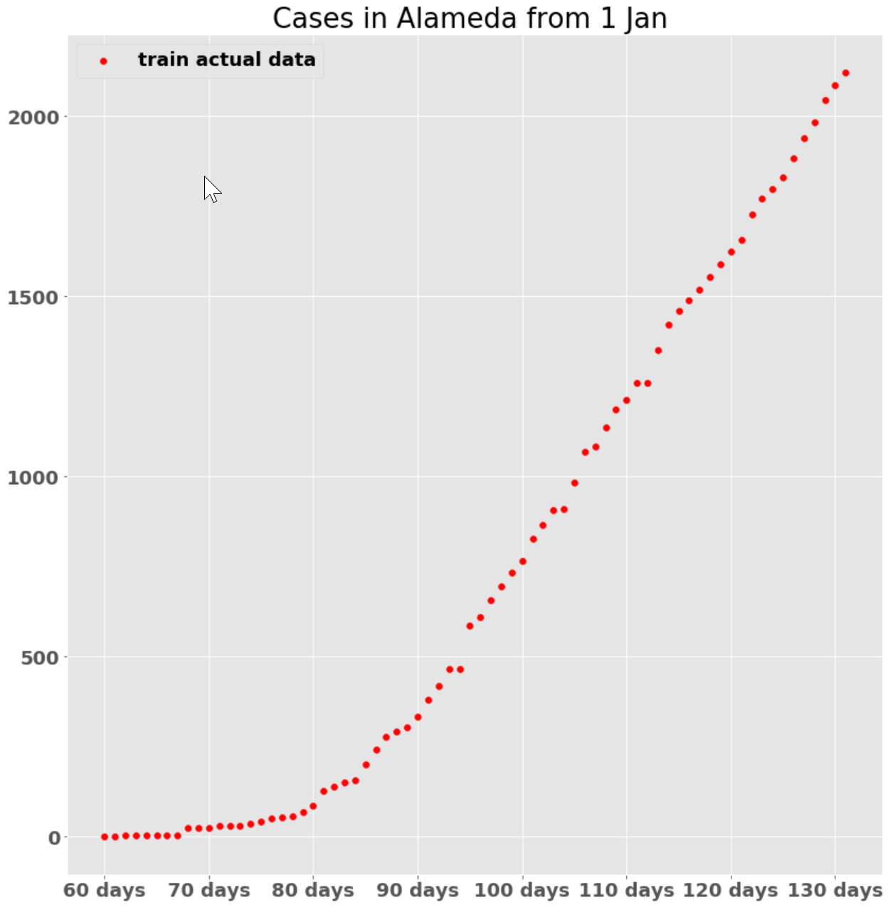
>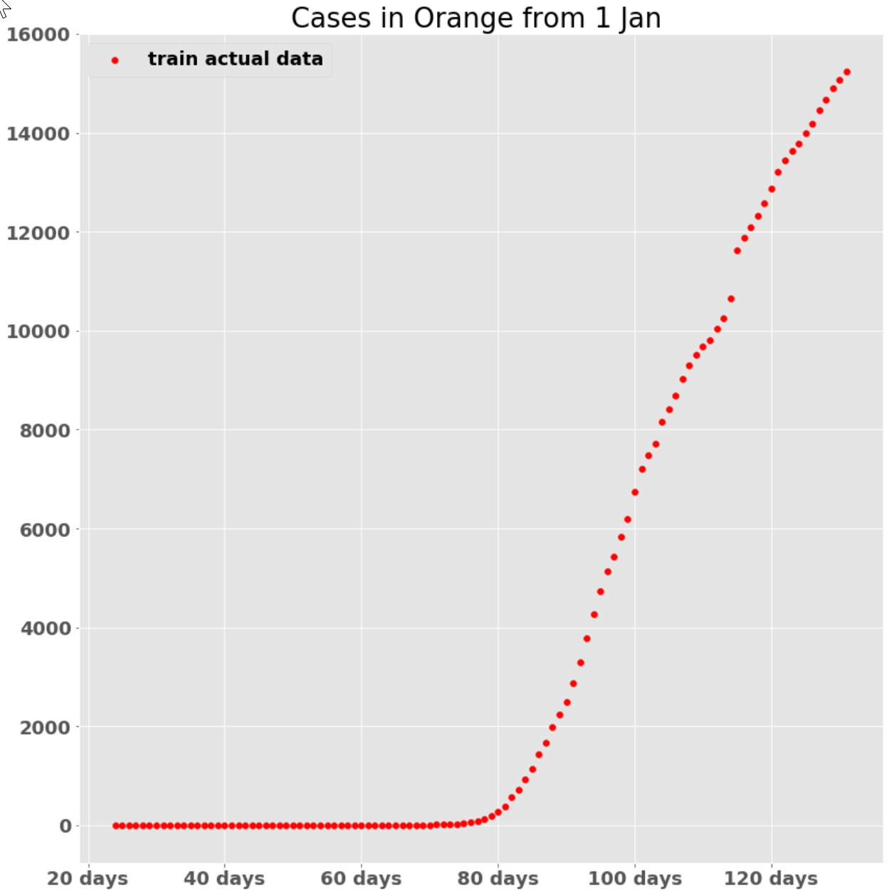

Alameda County had zero cases until day 60, whereas Orange County had cases, but they were a tiny number until day 75. The rapid spread does not kick off until a critical mass is reached. I tried a number of values and one case per 100k population seems to be pretty good. 

### Days Since Shelter in Place Declared
The number of days since shelter in place was declared at the state level. I did not take into consideration county level shelter in place orders. 

### Days Since Shelter in Place Lifted
The number of days since shelter in place was lifted at the state level. Again, I did not county and below orders. 

### Airport Arrivals
Using the counties data and the airports data, I created two features: imputed international arrivals and imputed domestic arrivals. In short, if an airport was within 100km of the center of a county, the annual arrivals, domestic and international, were assumed to impact that county. A simplistic algorithm, but sufficient for a start. 

### Population density and household density
Created population and household per square kilometer features. 

### Resulting Data Set
For the models I fused the two dataframes together, left joining on the larger, time-based dataframe as to not lose data. Here are the resulting fields:

- Date
- Death rate
- Case rate
- Days since Shelter in Place declared
- Days since Shelter in Place lifted
- Days since 10 cases per 100,000 residents
- Median household income
- Percent HS graduate
- Percent BA/BS+
- Perceent MA/MS+
- Median house price
- Median rent
- International air arrival indext
- Percent over 65
- Population density
- Household density

While the NYT Coronavirus data set has 139,802 rows as of 14 May 2020, my resulting data set only had 48,465 rows due to the fact that Census only provides data for 837 of 3,000 counties in the United States. That said, those counties encompass 84% of the population of the United States. In viewing the correlation matrix (Chart 1) fo these features, two things  are noteworthy: there is a lot of collinearity between features generally, but no features correlate strongly to the objective, case_rate. 

> Graph 1 - Feature Correlation Matrix
>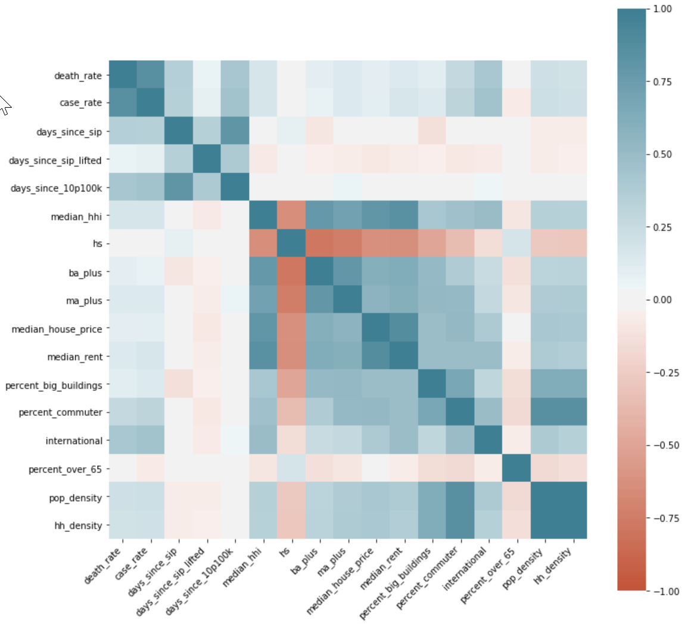

## Analysis
I applied a series of prediction models of increasing complexity to the data set, starting with a base, 'dumb', model and eventually ending with a tuned XGBoost model. 

### Base Model
As a base, 'dumb' model, I used the mean of the training set. That provided a benchmark RMSE of 283. The resulting actual vs predicted graph is shown in Graph 2.

> Graph 2 - Base 'Dumb' Model
>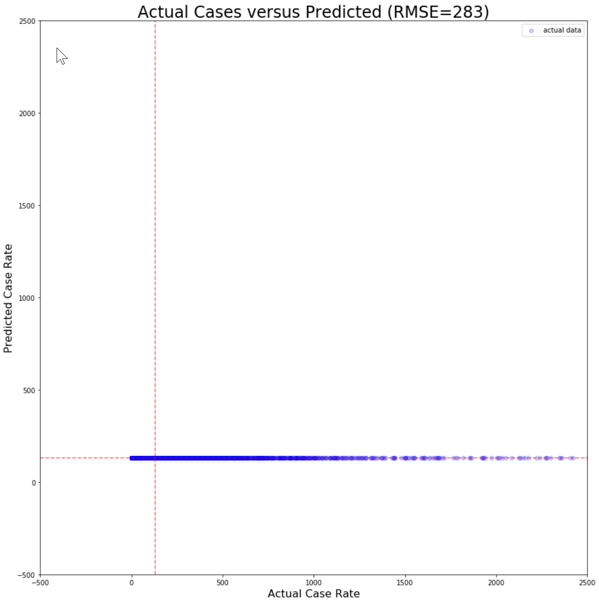

### Linear Regression Model
The next model I tried was a Linear Regression model with a polynomial feature of order 2. That provided an RMSE of 173, a considerable improvement over the base model. The resulting actual vs predicted graph is shown in Graph 3. I did not attempt to improve this other than by trying various orders on the polynomial feature , but rather jumped to XGBoost. 

> Graph 3 - Linear Model
>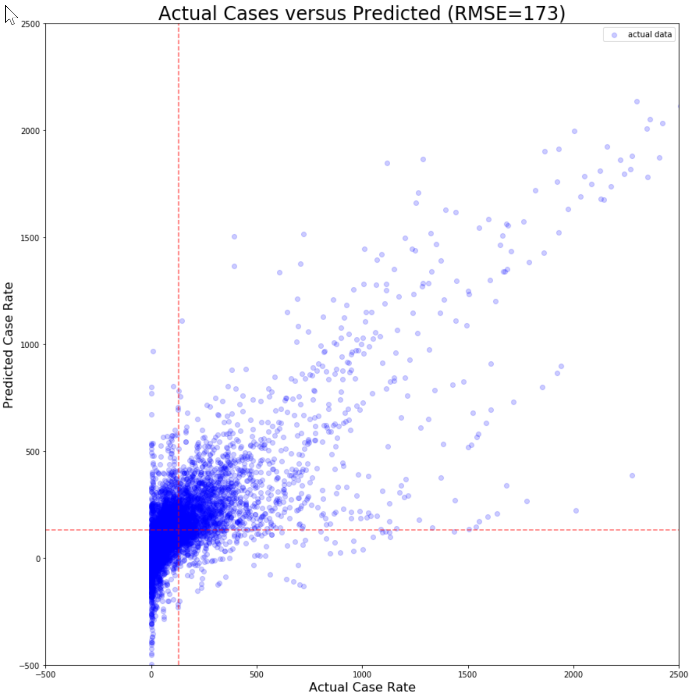

### Un-Tuned XGBoost Model
The next model I tried was a XGBoost model with no parameter tuning. That provided an RMSE of 28, a spectacular improvement over the base model. The resulting actual vs predicted graph is shown in Graph 4. This provided the best starting point so I pursued it.  

> Graph 4 - Tuned XGBoost Model
>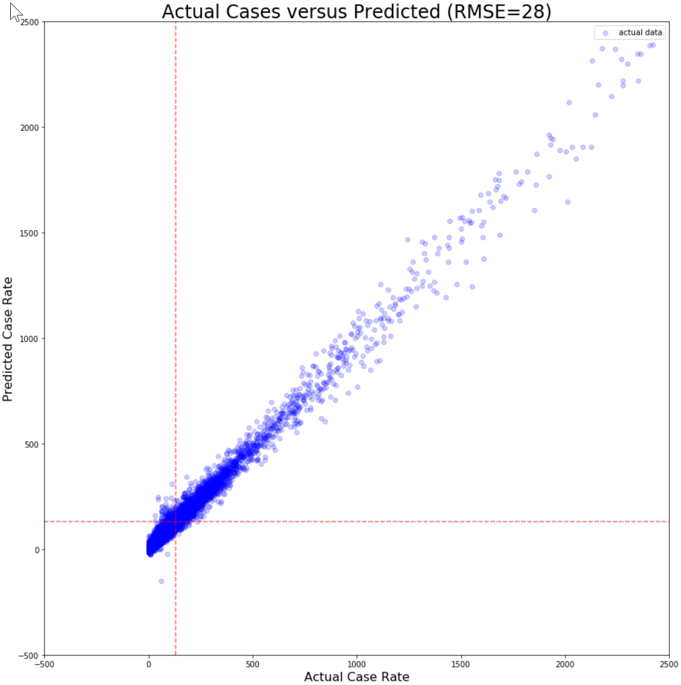

### Un-Tuned XGBoost Model
Using using AWS Sagemaker Studio I then executed a grid search on over a thousand combinations of hyper parameter values and identified what I believe to be the optimum. That provided an RMSE of 12. The resulting actual vs predicted graph is shown in Graph 5. 

> Graph 5 - Tuned XGBoost Model
>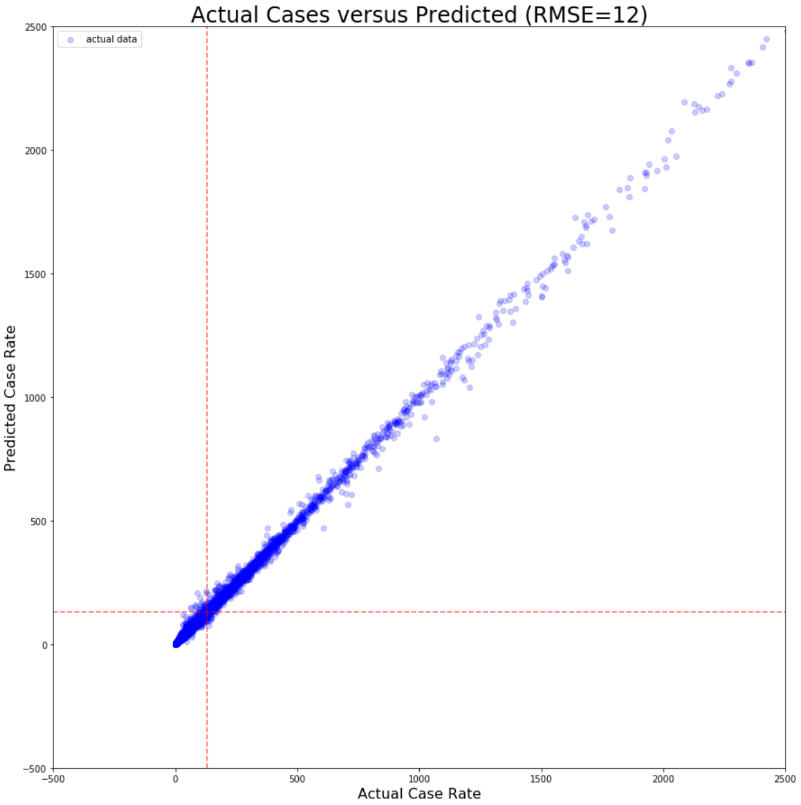

This result was good enough that I became concerned that I might have a data leakage issue. To explore this possibility, I inspected the feature importance values, as seen in Table X. 

> Table X - Feature Importance Values
>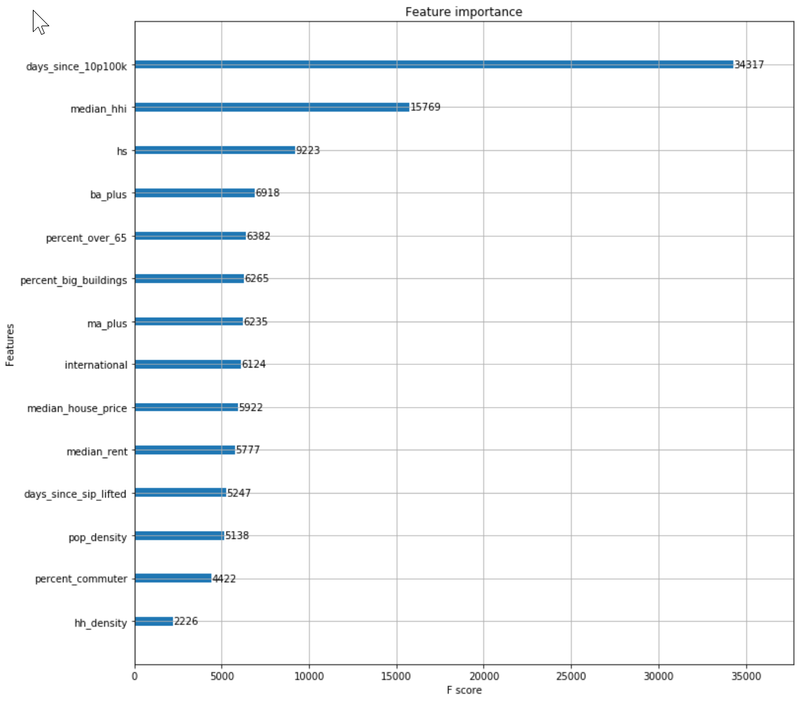

days_since_sip and days_since_10p100k are by far the most important features. days_since_sip could be a form of data leakage as no governor is going to declare shelter in place unless there is a problem. I wondered if it were possible that these two alone were predictive. To test that hypothesis I split the data set into two, one with just the three 'days since' features that I had created, the other with all of the static 'demography and geography' features. I ran the same XGBoost on both sets, yielding poor results, as seen in Graphs 6 and 7. While the tuned hyper parameters may not be good for these two subsets of the data, the initial results were so poor I opted not to tune them. 

> Graph 6 - Tuned XGBoost Model - Dynamic Features Only
>

> Graph 7 - Tuned XGBoost Model - Static Features Only
>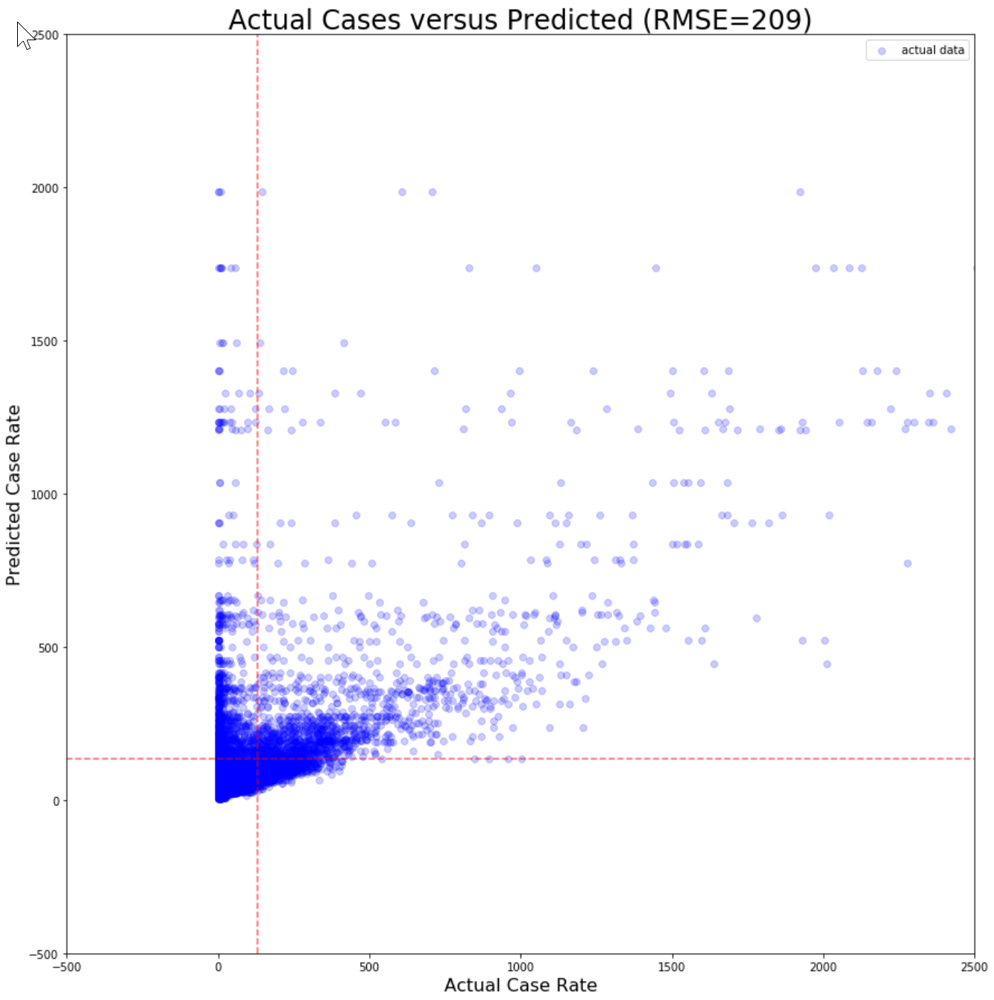

## Conclusion
Given the failure of the dynamic features alone and the static features alone to be predictive, I conclude that the tuned XGBoost model, with demographic features, geographic features, and governmental action features in combinatio
